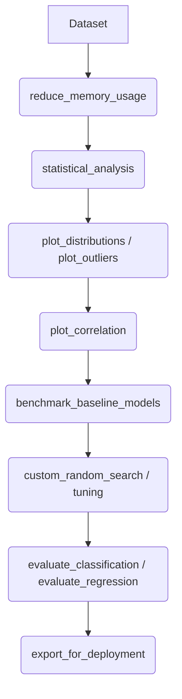

# Mostafa Toolkit User Guide

Welcome to the official user guide for **mostafa_toolkit**, a professional Python machine learning and data science package. This toolkit is designed to provide high-quality, reusable utilities for exploratory data analysis (EDA), data visualization, model evaluation, hyperparameter optimization, training callbacks, and model deployment.

This package was built to simplify the end-to-end machine learning lifecycle, bringing professional-grade engineering practices directly into notebooks and scripts. It features memory-efficient dataframe handling, advanced plotting dashboards, overfitting-controlled hyperparameter search, and seamless artifact serialization.

---

## Table of Contents
1. [Installation](#installation)
2. [Quick Start](#quick-start)
3. [Package Structure](#package-structure)
4. [Imported Libraries Reference](#imported-libraries-reference)
5. [Constants Reference](#constants-reference)
6. [EDA Module Reference](#eda-module-reference)
7. [Visualization Module Reference](#visualization-module-reference)
8. [Evaluation Module Reference](#evaluation-module-reference)
9. [Optimization Module Reference](#optimization-module-reference)
10. [Callbacks Module Reference](#callbacks-module-reference)
11. [Deployment Module Reference](#deployment-module-reference)
12. [Utilities Module Reference](#utilities-module-reference)
13. [End-to-End Workflow Guide](#end-to-end-workflow-guide)
14. [Best Practices](#best-practices)
15. [Troubleshooting](#troubleshooting)
16. [Frequently Asked Questions (FAQ)](#faq)
17. [API Cheat Sheet](#api-cheat-sheet)

---

## Installation

### Python Requirements
* Python `>= 3.8` (Tested on `3.11` and `3.13`)

### Editable Installation
To install the package in editable mode for local development, navigate to the root directory containing `pyproject.toml` and run:
```bash
pip install -e .
```

### Standard Installation
Once published or built, the library can be installed normally using:
```bash
pip install mostafa_toolkit
```

---

## Quick Start

Here is a minimal, complete working example showcasing the typical data analysis and modeling workflow using the toolkit.

```python
import numpy as np
import pandas as pd
from sklearn.ensemble import RandomForestRegressor
import mostafa_toolkit as mt

# 1. Load your dataset
data = {
    'feature1': np.random.rand(100) * 100,
    'feature2': np.random.rand(100) * 50,
    'target': np.random.rand(100) * 1000
}
df = pd.DataFrame(data)

# 2. Perform automated statistical analysis
mt.statistical_analysis(df)

# 3. Visualize correlations
mt.plot_correlation(df, target_col='target')

# 4. Train a scikit-learn model
X = df[['feature1', 'feature2']]
y = df['target']
model = RandomForestRegressor(random_state=42)
model.fit(X, y)

# 5. Export model for deployment
mt.export_for_deployment(model=model, model_name="rf_regressor")
```

### Explanation of the Quick Start:
1. `import mostafa_toolkit as mt`: Imports the entire public API (all modules and main functions are exposed on the top-level namespace).
2. `mt.statistical_analysis(df)`: Dynamically generates tables showing row counts, missing values, variable types, data distributions, and categorical cardinatilies.
3. `mt.plot_correlation(df, target_col='target')`: Generates a spectral heatmap showing Pearson correlation coefficients between all numerical variables and highlights correlations with the target.
4. `mt.export_for_deployment(...)`: Automatically saves the trained machine learning model into a serialization folder (`deployment_assets/`).

---

## Package Structure

The package is organized hierarchically into single-responsibility modules:

```text
mostafa_toolkit/
│
├── pyproject.toml              # Build configuration and dependency metadata
├── requirements.txt            # Dependency list
├── README.md                   # Repository overview
├── LICENSE                     # MIT License
│
├── tests/                      # Automated unit tests
│   ├── __init__.py
│   └── test_eda.py
│
├── mostafa_toolkit/
│   ├── __init__.py             # Exports public API and initializes config
│   ├── imports.py              # Single source of external libraries imports
│   ├── constants.py            # Global variables and plotting config constants
│   ├── config.py               # Global settings, environment variables, and seeds
│   ├── eda.py                  # Exploratory Data Analysis module
│   ├── preprocessing.py        # Preprocessing skeleton module
│   ├── visualization.py        # Plotting and dashboard functions
│   ├── evaluation.py           # Model metrics and ROC curve plots
│   ├── optimization.py         # Benchmarks and overfitting-safe random search
│   ├── callbacks.py            # Custom checkpoints for TensorFlow/Keras
│   ├── deployment.py           # Model and preprocessor serialization helper
│   └── utils.py                # Basic utility functions (e.g. downcasting memory)
```

---

## Imported Libraries Reference

The `imports.py` module groups all external dependencies. The table below outlines the core components and models exposed:

| Library / Estimator | Problem Type | Core Purpose | Typical Use Case |
| :--- | :--- | :--- | :--- |
| `pd` (Pandas) | N/A | Data structure manipulation | Loading and transforming tabular files. |
| `np` (NumPy) | N/A | High-performance array operations | Vector operations, seed alignment. |
| `plt` (Matplotlib) | N/A | Baseline visualization engine | Figure creation and canvas plotting. |
| `sns` (Seaborn) | N/A | High-level statistical visualization | Statistical distribution maps and heatmaps. |
| `RandomForestClassifier` | Classification | Ensemble bagging classifier | Tabular classification tasks. |
| `RandomForestRegressor` | Regression | Ensemble bagging regressor | Tabular regression tasks. |
| `GradientBoostingClassifier`| Classification | Boosting tree classifier | Complex non-linear classification. |
| `GradientBoostingRegressor` | Regression | Boosting tree regressor | Complex non-linear regression. |
| `XGBClassifier` / `XGBRegressor`| Both | High-performance gradient boosting | State-of-the-art tree-based performance. |
| `SVC` / `SVR` | Both | Support Vector Machines | Multi-feature hyper-plane margins. |
| `KNeighborsClassifier` | Both | Distance-based instance learning | Multi-modal local data mapping. |
| `Pipeline` | N/A | Sequence workflow chaining | Wrapping scaling and modeling elements. |
| `SMOTE` | Both | Synthetic oversampling | Resolving class imbalances. |

---

## Constants Reference

Exposed inside `constants.py`. These parameters govern aesthetic defaults and execution thresholds:

| Constant Name | Value | Purpose | Used In |
| :--- | :--- | :--- | :--- |
| `RANDOM_STATE` | `42` | Random state alignment seed | `config.py`, `optimization.py` |
| `DEFAULT_FIGSIZE` | `(10, 6)` | Default canvas size | `config.py` |
| `DEFAULT_N_ESTIMATORS` | `100` | Tree counts in bagging models | `optimization.py` |
| `DEFAULT_MAX_ITER` | `1000` | Max solver iterations | `optimization.py`, `config.py` |
| `DEFAULT_MAX_CARDINALITY` | `50` | Skips high-cardinality values | `eda.py` |
| `FONTSIZE_OVERVIEW_TABLE` | `"13px"` | Styling table text | `eda.py` |
| `FONTSIZE_STATS_TABLE` | `"12px"` | Styling table text | `eda.py` |
| `COLOR_RED_BAR` | `"#d65f5f"` | Null value gradient highlight | `eda.py` |
| `COLOR_BLUE_BAR` | `"#6baed6"` | Category representation bar color | `eda.py` |
| `DEFAULT_EDA_N_COLS` | `3` | Plotting subgrid layouts | `visualization.py` |
| `DEFAULT_OUTLIERS_N_COLS` | `4` | Plotting subgrid layouts | `visualization.py` |
| `DEFAULT_DIST_BINS` | `30` | Histogram default buckets | `visualization.py` |
| `COLOR_DIST_BLUE` | `'#3498db'` | Distribution plots color fill | `visualization.py` |
| `COLOR_OUTLIERS_GREEN` | `'#2ecc71'` | Box plot representation color | `visualization.py` |
| `BOXPLOT_WIDTH` | `0.5` | Box plot width size | `visualization.py` |
| `BOXPLOT_LINEWIDTH` | `1.5` | Box plot frame thickness | `visualization.py` |
| `PALETTE_MAGMA` | `'magma'` | Categorical color palette | `visualization.py` |
| `LABEL_ROTATION_DEGREES` | `45` | X-axis categorical label rotation | `visualization.py` |
| `CORRELATION_FIGSIZE` | `(20, 16)` | Heatmap chart size | `visualization.py` |
| `CMAP_SPECTRAL` | `'Spectral_r'` | Correlation heatmap color scheme | `visualization.py` |
| `CONF_MATRIX_FIGSIZE` | `(6, 5)` | Confusion matrix canvas size | `evaluation.py` |
| `CMAP_BLUES` | `'Blues'` | Confusion matrix color scheme | `evaluation.py` |
| `ROC_FIGSIZE` | `(8, 6)` | ROC canvas size | `evaluation.py` |
| `BENCHMARK_KNN_LIMIT` | `50000` | Excludes KNN on large samples | `optimization.py` |
| `BENCHMARK_SVM_LIMIT` | `20000` | Excludes SVM on large samples | `optimization.py` |
| `DEFAULT_N_ITERATIONS` | `10` | Random search iteration size | `optimization.py` |
| `DEFAULT_MAX_DIFF` | `0.05` | Max gap validation-training | `optimization.py` |
| `DEFAULT_DEPLOYMENT_DIR` | `"deployment_assets"` | Model artifacts output folder | `deployment.py` |

---

## EDA Module Reference

### `statistical_analysis`

#### Purpose
Generates complete Markdown tables detailing rows, columns, duplicated rows, data types, missing counts, numerical metrics, and categorical value distributions.

#### When should I use it?
Use at the absolute beginning of any data science project to immediately profile new datasets.

#### Syntax
```python
def statistical_analysis(df, max_cardinality=DEFAULT_MAX_CARDINALITY):
```

#### Parameters
| Parameter | Type | Default | Required | Description |
| :--- | :--- | :--- | :--- | :--- |
| `df` | `pd.DataFrame` | None | Yes | Target pandas DataFrame to analyze. |
| `max_cardinality` | `int` | `50` | No | Limits display of categorical unique levels. |

#### Returns
* `None`. Outputs tables directly to IPython/Jupyter displays.

#### Raises
* `TypeError`: If input `df` is not a Pandas DataFrame.

#### Internal Workflow
1. Calculates shape and row/column counts.
2. Formulates overview dataframe detailing total missing values and duplicates.
3. Builds data-type mapping with null percentage highlights.
4. Generates standard statistics metrics (`describe().T`).
5. Generates value counts bar mappings for all categoricals below `max_cardinality`.

#### Examples
```python
import pandas as pd
import mostafa_toolkit as mt

df = pd.read_csv("house_prices.csv")
mt.statistical_analysis(df, max_cardinality=20)
```

---

## Visualization Module Reference

### `plot_distributions`

#### Purpose
Creates a grid layout of histograms for all numerical columns in a dataframe.

#### Syntax
```python
def plot_distributions(df, columns=None, n_cols=DEFAULT_EDA_N_COLS):
```

#### Parameters
| Parameter | Type | Default | Required | Description |
| :--- | :--- | :--- | :--- | :--- |
| `df` | `pd.DataFrame` | None | Yes | Target dataframe containing numbers. |
| `columns` | `list` | `None` | No | Specific columns list to plot. |
| `n_cols` | `int` | `3` | No | Column layout factor of subplots. |

#### Examples
```python
import mostafa_toolkit as mt
mt.plot_distributions(df, columns=['Age', 'Income'])
```

---

### `plot_outliers`

#### Purpose
Creates box plots to visualize the distribution and outliers of numerical fields.

#### Syntax
```python
def plot_outliers(df, columns=None, n_cols=DEFAULT_OUTLIERS_N_COLS):
```

#### Examples
```python
import mostafa_toolkit as mt
mt.plot_outliers(df, columns=['Fare', 'Salary'])
```

---

### `plot_categoricals`

#### Purpose
Generates bar plots showing frequency counts for categorical variables.

#### Syntax
```python
def plot_categoricals(df, columns=None, n_cols=DEFAULT_CATEGORICALS_N_COLS):
```

---

### `plot_target_distribution`

#### Purpose
Plots target counts (bar chart for classification) or density curves (histograms for regression).

#### Syntax
```python
def plot_target_distribution(df, target_col, task_type='classification'):
```

---

### `plot_correlation`

#### Purpose
Generates a Pearson correlation heatmap and lists top correlated columns with target.

#### Syntax
```python
def plot_correlation(df, target_col=None):
```

---

### `plot_dynamic_learning_curves`

#### Purpose
Scans a Keras training `History` object and builds learning curves for loss, metrics, and learning rate.

#### Syntax
```python
def plot_dynamic_learning_curves(history):
```

---

## Evaluation Module Reference

### `evaluate_classification`

#### Purpose
Prints precision, recall, accuracy, and F1 reports, alongside a plotted Confusion Matrix.

#### Syntax
```python
def evaluate_classification(y_true, y_pred, class_names=None):
```

---

### `plot_roc_auc`

#### Purpose
Plots Receiver Operating Characteristic (ROC) curve supporting binary and multiclass.

#### Syntax
```python
def plot_roc_auc(y_true, y_proba, class_names=None):
```

---

### `evaluate_regression`

#### Purpose
Calculates MAE, MSE, RMSE, and $R^2$ variance explanation.

#### Syntax
```python
def evaluate_regression(y_true, y_pred):
```

---

## Optimization Module Reference

### `benchmark_baseline_models`

#### Purpose
Trains models (LR, DT, RF, GBDT, XGBoost, and conditionally KNN/SVM depending on size) and prints a sorted diagnostic dataframe leaderboard.

#### Syntax
```python
def benchmark_baseline_models(X_train, y_train, X_test, y_test, task='classification'):
```

---

### `get_combined_feature_importance`

#### Purpose
Trains Random Forests across multiple target features, computing averaged importance scores.

#### Syntax
```python
def get_combined_feature_importance(X_train, y_train, target_dict, n_estimators=DEFAULT_N_ESTIMATORS, max_depth=None, random_state=RANDOM_STATE):
```

---

### `custom_random_search`

#### Purpose
Randomized search for classifiers selecting best parameters where the generalization gap (Train score - Val score) is less than `max_diff`.

#### Syntax
```python
def custom_random_search(model, X_train, y_train, X_val, y_val, param_distributions, n_iterations=DEFAULT_N_ITERATIONS, max_diff=DEFAULT_MAX_DIFF, focus_accuracy=True, focus_precision=False, focus_recall=False, focus_f1=False):
```

---

### `custom_random_search_regression`

#### Purpose
Same as classification search, but optimized for regression metrics ($R^2$, RMSE, MAE).

#### Syntax
```python
def custom_random_search_regression(model, X_train, y_train, X_val, y_val, param_distributions, n_iterations=DEFAULT_N_ITERATIONS, max_diff=DEFAULT_MAX_DIFF, focus_r2=True, focus_rmse=False, focus_mae=False):
```

---

## Callbacks Module Reference

### `RegressionMetricCheckpoint`

#### Purpose
Keras callback saving the best model based on regression metrics with validation loss as a tie-breaker.

#### Syntax
```python
class RegressionMetricCheckpoint(Callback):
    def __init__(self, filepath, monitor_metric="val_mse", mode="min"):
```

---

### `DynamicClassificationCheckpoint`

#### Purpose
Keras callback saving the best classification model.

#### Syntax
```python
class DynamicClassificationCheckpoint(Callback):
    def __init__(self, filepath, monitor_metric="val_accuracy"):
```

---

## Deployment Module Reference

### `export_for_deployment`

#### Purpose
Serializes trained models (`.joblib` or `.keras`) and preprocessor transformers.

#### Syntax
```python
def export_for_deployment(model=None, preprocessor=None, model_name="final_model", preprocessor_name="pipeline", is_dl_model=False):
```

---

## Utilities Module Reference

### `reduce_memory_usage`

#### Purpose
Optimizes data types of dataframe columns (downcasting types) without losing precision info.

#### Syntax
```python
def reduce_memory_usage(df):
```

---

## End-to-End Workflow Guide

Follow this sequence to use the toolkit effectively:



1. **Memory Compression**: Downcast dataset numerical columns using `reduce_memory_usage`.
2. **Profiling**: Execute `statistical_analysis` to identify column counts, types, and empty values.
3. **Data Check**: Generate outlier box plots and histograms to visualize the data distribution.
4. **Baseline Modeling**: Train multiple models using `benchmark_baseline_models` to establish performance baselines.
5. **Hyperparameter Search**: Tune best performing baseline with `custom_random_search` to find stable weights.
6. **Deployment**: Save final model output assets via `export_for_deployment`.

---

## Best Practices

* **Seed Seeding**: Always import `mostafa_toolkit.config` or `mostafa_toolkit` at the top of your main execution script. This enforces reproducible output streams (`random`, `numpy`, and `tensorflow` seeds set to `42`).
* **Visual Export**: Check fflier settings in `plot_outliers` to speed up rendering loops for high-volume datasets.
* **Large Datasets**: Let `benchmark_baseline_models` automatically handle dropping complex solvers (like Support Vector Machines) if sample counts exceed configured safety limits.

---

## Troubleshooting

### `ModuleNotFoundError: No module named 'tensorflow'`
Ensure you have TensorFlow installed. If using different Python environments, match your active notebook environment to where the package was installed (`pip install` vs `py -3.11 -m pip`).

### `AttributeError: module 'mostafa_toolkit' has no attribute 'X'`
This occurs when the modules are imported directly via relative directory loops. Import via namespace: `from mostafa_toolkit import statistical_analysis`.

---

## FAQ

#### Can I use this library with PyTorch?
Yes, but the custom callback modules (`RegressionMetricCheckpoint` and `DynamicClassificationCheckpoint`) specifically target TensorFlow Keras subclasses. Modeling, EDA, and validation workflows are model-agnostic.

#### How do I disable seeding overrides?
Modify the seed variables in `constants.py` or modify variables inside `config.py` prior to loading.

---

## API Cheat Sheet

| Function | Module | Purpose | Typical Use Case |
| :--- | :--- | :--- | :--- |
| `reduce_memory_usage(df)` | `utils` | Compress numerical data types | Initial dataset loading |
| `statistical_analysis(df)` | `eda` | Print profile tables | Dataset exploration |
| `plot_correlation(df)` | `visualization` | Show Pearson coefficients matrix | Collinearity checks |
| `evaluate_classification(y, pred)`| `evaluation` | Classification scores & Confusion matrix | Model assessment |
| `benchmark_baseline_models(...)` | `optimization` | Benchmark default models | Baseline assessment |
| `export_for_deployment(...)` | `deployment` | Serialize preprocessors and model assets | Final model saving |

---

## Complete API Reference

```python
# Importable top-level methods:
from mostafa_toolkit import (
    statistical_analysis,
    plot_distributions,
    plot_outliers,
    plot_categoricals,
    plot_target_distribution,
    plot_correlation,
    plot_dynamic_learning_curves,
    evaluate_classification,
    evaluate_regression,
    plot_roc_auc,
    benchmark_baseline_models,
    get_combined_feature_importance,
    custom_random_search,
    custom_random_search_regression,
    RegressionMetricCheckpoint,
    DynamicClassificationCheckpoint,
    export_for_deployment,
    reduce_memory_usage
)
```
